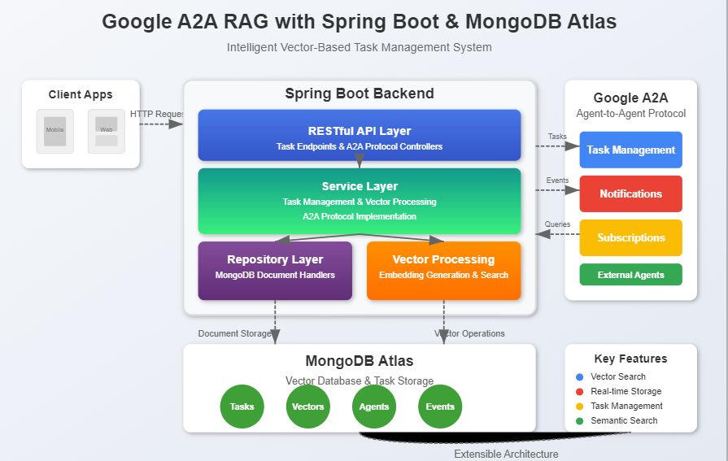
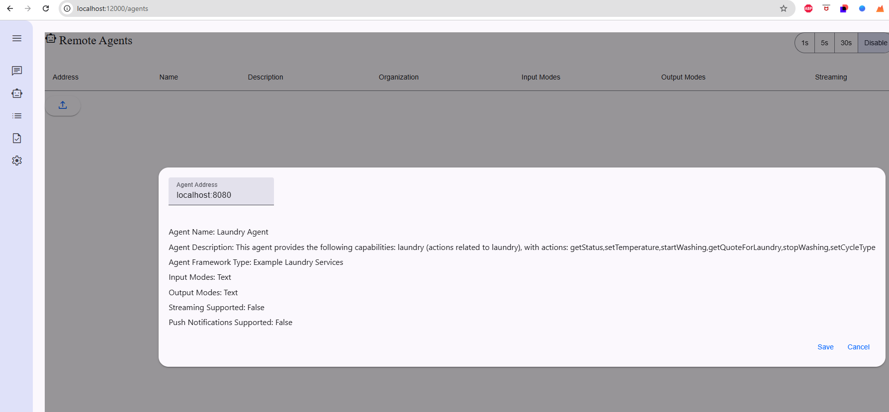
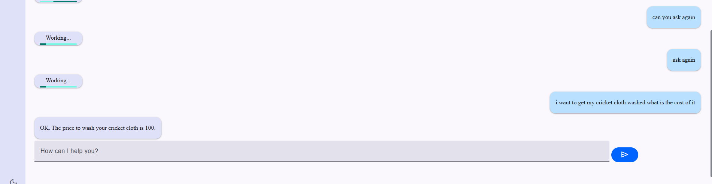
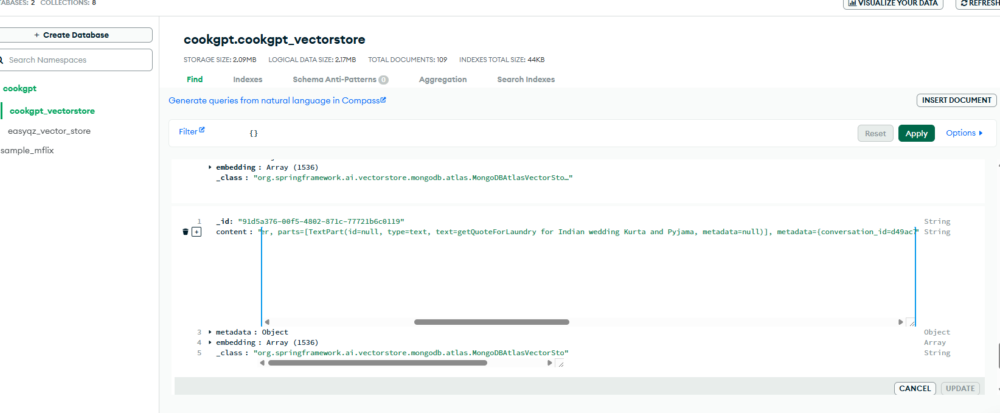
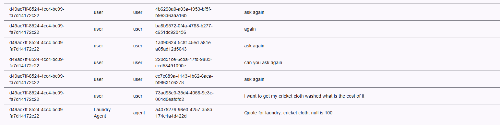
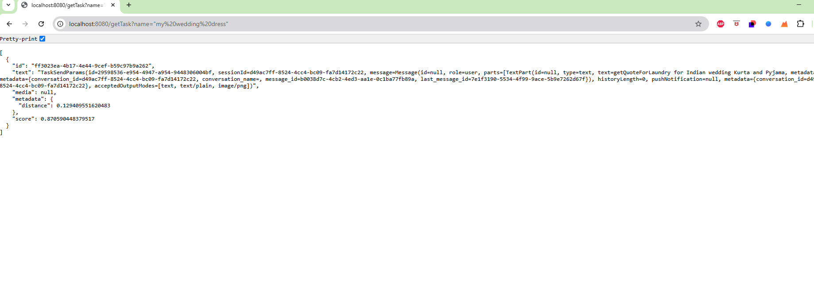

# 🤖 Google A2A RAG with Spring, Java, and MongoDB Atlas

This project demonstrates how to build a powerful **Retrieval-Augmented Generation (RAG)** search application that integrates Google's Agent-to-Agent (A2A) protocol with Spring Boot and MongoDB Atlas. The system enables intelligent task management and semantic search capabilities through vector embeddings.

## 🌟 Key Features

- **A2A Protocol Integration**: Seamless communication between AI agents
- **Vector-Based Search**: Powered by MongoDB Atlas for semantic task retrieval
- **Real-time Task Storage**: Automatic storage of A2A tasks in vector database
- **RESTful API**: Easy-to-use endpoints for task management
- **Spring Boot Framework**: Built with enterprise-grade Java technology
- **Extensible Architecture**: Adaptable for various use cases

## 🛠️ Technology Stack

- **Backend**: Spring Boot 3.x
- **Database**: MongoDB Atlas with Vector Search
- **Protocol**: Google A2A (Agent-to-Agent)
- **Search**: Vector-based semantic search
- **API Documentation**: OpenAPI/Swagger

  

## 📝 How It Works

### Vector Storage Integration

The system automatically stores A2A tasks in MongoDB's vector store through a preprocessing hook:

```java
@Override
public void preProcessing(String method, Object params) {
    vectorService.ragStorage(method, params);
}
```

### Task Management

The service handles various A2A task types:
- Task sending and querying
- Task subscriptions
- Push notifications
- Task cancellations
- Resubscriptions

Here's a brief overview of the task storage mechanism:

```java
public void ragStorage(String method, Object params) {
    switch (method) {
        case "tasks/send":
            addTask(new ObjectMapper().convertValue(params, TaskSendParams.class));
            break;
        case "tasks/get":
            addTask(new ObjectMapper().convertValue(params, TaskQueryParams.class));
            break;
        // Additional task types handled...
    }
}
```

## 📸 Visual Guide

### 1. Agent Setup

*Adding an A2A agent to your client application*

### 2. Chat Interface

*Example of normal chat interaction*

### 3. Data Storage

*Task data stored in MongoDB Atlas*

### 4. Event Monitoring

*Event tracking and monitoring interface*

## 🔍 Using the API

### Task Retrieval Example
```http
GET http://localhost:8080/getTask?name="cricket"
```



This endpoint demonstrates the semantic search capabilities, retrieving tasks related to the given query using vector similarity.

## 🚀 Getting Started

1. Clone the repository
2. Configure MongoDB Atlas connection in `application.yml`
3. Set up environment variables:
   - `DB_USER`
   - `DB_PASSWORD`
   - `OPENAI_API_KEY`
4. Build and run with Maven:
   ```bash
   mvn spring-boot:run
   ```

## 📄 License

This project is licensed under the MIT License - see the LICENSE file for details.

## 🤝 Contributing

Contributions are welcome! Please feel free to submit a Pull Request.